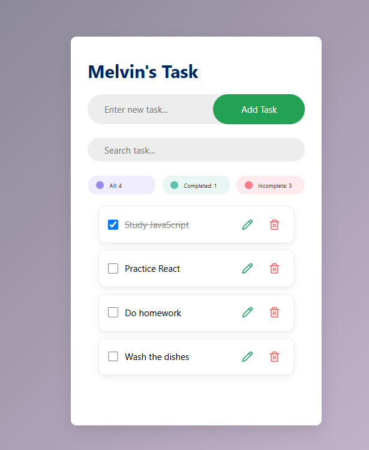

# ✅ Task Manager

A simple and responsive task management app built with React. Create, edit, delete, search, and track your tasks through a clean and easy-to-use interface.



## 🔗 Live Demo

https://melvin-12143031.github.io/task-manager/

## ✨ Features

* ➕ Add new tasks
* ✏️ Edit existing tasks
* 🗑️ Delete tasks with confirmation
* 🔍 Search tasks
* 📊 Track task progress
* ✅ Mark tasks as completed
* 📱 Responsive design
* 🧩 Reusable React components
* 📄 Task data stored in JSON

## 🛠️ Built With

* React
* JavaScript
* CSS
* Vite
* JSON

## 📂 Project Structure

```text
src/
├── components/
│   ├── DeleteDialog.jsx
│   ├── EditDialog.jsx
│   ├── SearchBar.jsx
│   ├── Task.jsx
│   ├── TaskCounter.jsx
│   └── TaskInput.jsx
├── data/
│   └── tasks.json
├── App.jsx
├── App.css
├── index.css
└── main.jsx
```

## 🚀 Getting Started

### 1. Clone the repository

```bash
git clone https://github.com/Melvin-12143031/task-manager.git
```

### 2. Navigate to the project

```bash
cd task-manager
```

### 3. Install dependencies

```bash
npm install
```

### 4. Start the development server

```bash
npm run dev
```

Then open the local URL provided by Vite.

## 📦 Build for Production

```bash
npm run build
```

## 🌐 Deploy to GitHub Pages

```bash
npm run deploy
```

## 📌 Project Purpose

This project was built as part of my React learning journey to practice component-based development, state management, forms, dialogs, searching, and reusable UI components.

---

Made with React ⚛️
